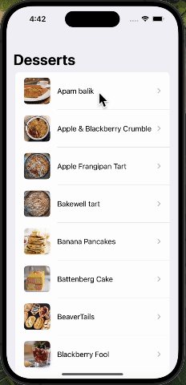

# Say Hi
Hi, developers at Fetch Rewards,

Thank you for taking the time to look at my project. Developing this app was a really fun experience, and I learned a lot in the process. I hope you find it interesting and enjoy exploring its features as much as I enjoyed building it.

Have a great day!

# Recipe App

The Recipe App is a simple iOS application that allows users to browse through a list of dessert recipes, view detailed instructions, ingredients, and measurements for each recipe. Built with SwiftUI, the app fetches data from [TheMealDB](https://www.themealdb.com/api.php) API, presenting it in a user-friendly format.

## Demo


## Features

- **Browse Recipes**: Users can scroll through a list of dessert recipes sorted alphabetically.
- **Recipe Details**: Tapping on a recipe takes the user to a detail view where they can see ingredients, measurements, and cooking instructions.


## Getting Started

1. Clone the repository:
   ```sh
   git clone https://github.com/yourusername/recipe-app.git
   ```
2. Open the project in Xcode:
   ```sh
   open RecipeApp.xcodeproj
   ```
3. Choose a target device or simulator.
4. Press Run to build and run the app.


## Contact
Email: tyang328@wisc.edu
LinkedIn: https://www.linkedin.com/in/tongluy/
